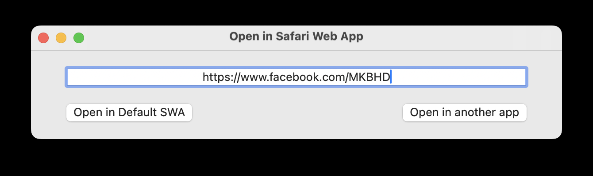

#  Open a link in a Safari Web App.

With macOS 14 Sonoma, Apple introduced Safari Web Apps (SWA), which turns a website into an application. Personally I think Safari Web App is a much better concept than Progressive Web App. Because each SWA is a separate instance from Safari, its history will no longer be a part of Safari's history. I find the best use case is open a private tab in Safari, then select Add to Dock. And we'll have an app-like experience.
However, the downside is we can't, or couldn't actually, directly open a link with a SWA. For example, I had a Facebook SWA, and when I wanted to open a direct link, say 'https://wwww.facebook.com/MKBHD' with the Facebook SWA, I couldn't. I had to use Safari then "Open with Facebook" button, which took too much time for such as simple task. But now there is **Open in SWA**. Simply paste the link into the text box and press Return/Enter on your keyboard and the app will take care of the rest. No more Safari involved.
You can also make a right click on an appropriate link, then select Share → Open In SWA and the correct SWA will be invoked, or simply drag the link into the Dock icon, which is handy in case you're using a different browser than Safari that doesn't support Share action.
If an app offers "Open with" (a web browser) feature such as , you can select Open In SWA in the list.

**Screenshot**

